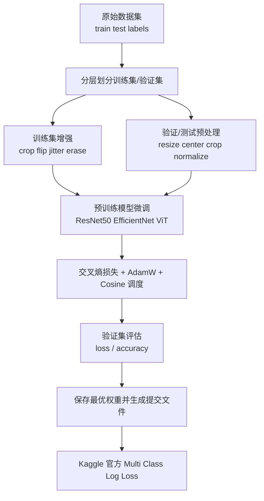

# 犬种图像分类技术报告

## 目录

- [摘要](#abstract)
- [一、任务定义与评价指标](#task-metric)
- [二、方法设计](#method)
- [三、三组实验方案](#experiments)
- [四、实验结果](#results)
- [五、结果分析](#analysis)
- [六、结论](#conclusion)

## 摘要

本项目围绕 Kaggle `Dog Breed Identification` 数据集完成 <strong>120 类犬种图像分类任务</strong>。数据集中包含 <strong>10222 张带标签训练图像</strong> 和 <strong>10357 张测试图像</strong>，本文按照固定随机种子将训练集划分为 <strong>8177 张训练样本</strong> 与 <strong>2045 张验证样本</strong>，在统一的数据划分上分别训练 `ResNet50`、`EfficientNet-B0` 和 `ViT-B/16` 三种迁移学习模型，并将生成的 `submission.csv` 提交到 Kaggle 平台获得官方 `Multi Class Log Loss` 分数。整体结果表明，<strong>Vision Transformer 在本任务上取得了最好的验证集表现和 Kaggle 结果</strong>，`ViT-B/16` 的验证集 `val_loss` 为 <strong>1.2968</strong>、验证集准确率为 <strong>84.74%</strong>，Kaggle 官方截图中的 `Multi Class Log Loss` 为 <strong>0.66097</strong>；`EfficientNet-B0` 以更强的数据增强和较小的泛化间隙取得第二名，Kaggle 分数为 <strong>0.68905</strong>；面向吞吐优化的 `ResNet50_tuned_fast` 虽然训练速度更友好，但最终仍受到更明显过拟合的影响，Kaggle 分数为 <strong>0.77511</strong>。

## 一、任务定义与评价指标

本任务的核心不是只给出一张测试图像的单一类别，而是为每张测试图像输出属于全部 120 个犬种类别的概率分布。由于 Kaggle 官方采用的是 <strong>`Multi Class Log Loss`</strong>，因此模型不仅要预测正确的类别，还要给出合理且稳定的置信度。如果模型虽然能够做对 top-1 分类，但对错误类别给出了过高概率，那么在排行榜上的损失仍会明显变差。这一点决定了本文更重视 <strong>验证集 `loss` 与概率校准</strong>，而不仅仅关注验证集准确率。

从训练目标来看，项目使用交叉熵损失进行监督学习，它与 Kaggle 的多分类对数损失在形式上高度一致。对于单个样本，训练损失与测试评估都可以写成下面的形式，其中 $y_{ic}$ 表示第 $i$ 个样本在第 $c$ 类上的 one-hot 标签，$p_{ic}$ 表示模型预测概率：

$$
\mathcal{L}_{\text{CE}} = - \sum_{c=1}^{C} y_c \log p_c
$$

$$
\mathrm{LogLoss} = - \frac{1}{N} \sum_{i=1}^{N} \sum_{c=1}^{C} y_{ic}\log p_{ic}
$$

这也是为什么本文在结果分析中会把验证集 `val_loss` 与 Kaggle `Multi Class Log Loss` 放在一起讨论，因为二者在目标层面比 `accuracy` 更一致，能够更真实地反映模型的概率输出质量。<strong>换言之，本报告更看重“概率分布是否可靠”，而不是只看 top-1 是否命中。</strong>

## 二、方法设计

本文采用基于 `torchvision` 预训练权重的迁移学习方案，将自然图像分类模型迁移到细粒度犬种识别任务上。整体流程从数据预处理开始，先读取 `labels.csv` 与 `sample_submission.csv` 构建类别索引，再对训练数据做分层划分，以保证训练集和验证集在 120 个类别上的分布尽可能一致。训练阶段对训练集引入随机裁剪、翻转、颜色扰动、随机擦除等增强手段，对验证集与测试集则使用确定性的 `Resize + CenterCrop + Normalize`，确保模型比较具有可重复性。模型输出的 logits 经过 `softmax` 后得到 120 维类别概率，最终再根据提交格式导出为 `submission.csv`。<strong>方法主线可以概括为“分层划分 + 预训练微调 + 数据增强 + 概率输出 + Kaggle 官方评估”。</strong>

训练框架层面，三个实验都采用 `AdamW` 优化器、余弦退火学习率调度、`label smoothing=0.1` 和混合精度训练。这样的设计有两个目的。第一，`AdamW` 在迁移学习和 Transformer 微调中通常更稳定，能够兼顾收敛速度与泛化能力。第二，余弦退火让学习率在训练后期平滑下降，适合预训练模型的细调过程。代码中同时保留了冻结骨干网络若干 epoch、自动保存最优权重、绘制训练曲线与早停判断等机制，便于后续做对照实验和结果追踪。<strong>统一训练框架保证了三组模型比较的公平性。</strong>

## 三、三组实验方案

`ResNet50_tuned_fast` 是在基线卷积网络上针对 GPU 利用率偏低和泛化不足问题做出的综合调优版本。它使用预训练 `ResNet50` 作为特征提取骨干，前 <strong>1 个 epoch 冻结骨干网络</strong>，只训练分类头，随后解冻全模型继续微调。数据增强部分采用较强的 `RandomResizedCrop`、旋转、颜色扰动、随机灰度、透视变换、`RandAugment` 和 `RandomErasing`，训练批量设置为 <strong>64</strong>，验证批量扩展为 <strong>128</strong>，并通过 `num_workers=8`、`prefetch_factor=4`、`cudnn_benchmark=true` 提升吞吐。这个版本的设计重点是让卷积模型在不牺牲过多稳定性的前提下更快训练，但从最终结果看，它依然保留了比较明显的过拟合倾向。

`EfficientNet-B0_strong_aug` 采用的是更强调参数效率和强数据增强的卷积架构。与 ResNet 相比，EfficientNet 在宽度、深度和分辨率之间做了更协调的复合缩放，因此在中小规模细粒度分类任务上通常能以更少的参数获得更好的泛化表现。本实验中它同样先冻结 <strong>1 个 epoch</strong> 的骨干网络，然后进行全量微调；训练批量为 <strong>128</strong>，学习率为 <strong>`2.5e-4`</strong>，配合更强的 `ColorJitter`、透视变换、模糊、`RandAugment` 和较高概率的随机擦除，从而把卷积网络容易记忆局部纹理的倾向压制下来。结果上，这一策略显著缩小了训练集与验证集之间的性能差距，使 EfficientNet 成为卷积模型中最稳健的一组实验。

`ViT-B/16_finetune` 代表 Transformer 路线。该模型不再依赖传统卷积的局部感受野，而是将图像划分为 patch 后做全局自注意力建模，因此在细粒度类别之间存在复杂空间关系时往往更有优势。本实验直接对预训练 `ViT-B/16` 做全量微调，不设置骨干冻结阶段，训练批量设为 <strong>16</strong>，学习率设为 <strong>`1e-4`</strong>，并使用较温和的增强策略，包括轻量随机裁剪、较小角度旋转、轻度颜色扰动、`TrivialAugmentWide` 与 `RandomErasing`。这种相对保守的增强配置是有意为之，因为对于 Transformer 而言，过强的几何扰动有时会破坏 patch 级别的全局结构表达，而适度增强反而更利于稳定收敛。

## 四、实验结果

三组实验在验证集和 Kaggle 平台上的核心结果如表所示。需要强调的是，<strong>Kaggle 分数越小越好</strong>，因为它度量的是多分类对数损失；从排序关系看，`val_loss` 的优劣顺序与 Kaggle `Multi Class Log Loss` 基本一致，这说明本地验证集划分具有较好的代表性。

| 模型 | 最优 epoch | 验证集 loss | 验证集 accuracy | Kaggle Multi Class Log Loss |
| --- | ---: | ---: | ---: | ---: |
| ResNet50_tuned_fast | 23 | 1.3830 | 81.42% | <strong>0.77511</strong> |
| EfficientNet-B0_strong_aug | 18 | 1.3471 | 83.23% | <strong>0.68905</strong> |
| <strong>ViT-B/16_finetune</strong> | <strong>12</strong> | <strong>1.2968</strong> | <strong>84.74%</strong> | <strong>0.66097</strong> |

从验证集指标看，`ViT-B/16` 在训练到第 <strong>12 个 epoch</strong> 时取得了 <strong>最低的验证损失</strong> 和 <strong>最高的验证准确率</strong>，说明 Transformer 的全局建模能力在该细粒度犬种识别任务上具有明显优势。`EfficientNet-B0` 紧随其后，虽然 top-1 准确率略低于 ViT，但其验证曲线更加平滑，训练末期没有出现严重震荡。`ResNet50_tuned_fast` 则在第 23 个 epoch 附近达到最优验证损失，此后损失基本不再下降，说明它已经进入了较强的拟合阶段。

图 1 展示了 `ResNet50_tuned_fast` 的训练曲线。可以看到训练集准确率在后期迅速逼近 1，而验证集准确率提升幅度较为有限，同时训练损失与验证损失之间的间隔明显扩大，这说明模型虽然学得很充分，但泛化能力提升并不充分。从最优 epoch 的数据看，它的训练集准确率和验证集准确率相差约 <strong>16.54%</strong>，是三组实验里最大的间隙，这也是其最终 Kaggle 分数相对落后的主要原因。

图 2 为 `ResNet50_tuned_fast` 的 Kaggle 官方提交截图，截图识别出的 `Multi Class Log Loss` 为 <strong>0.77511</strong>。这一结果与本地验证集上偏高的 `val_loss` 相一致，说明尽管该版本在吞吐优化上更积极，但卷积骨干本身仍然更容易对训练集纹理细节产生过拟合。

图 3 展示了 `EfficientNet-B0_strong_aug` 的训练曲线。与 ResNet 相比，EfficientNet 的训练集和验证集曲线之间更接近，最优 epoch 时训练集准确率与验证集准确率的差距约为 <strong>8.03%</strong>，是三者中最小的。这说明更强的数据增强和 EfficientNet 更协调的参数利用方式有效抑制了过拟合。虽然它的训练集准确率不如 ResNet 那么高，但验证损失更低，恰恰说明模型的概率分布更稳定、更接近比赛目标。

图 4 为 `EfficientNet-B0_strong_aug` 的 Kaggle 官方提交截图，对应 `Multi Class Log Loss` 为 <strong>0.68905</strong>。这一成绩明显优于 ResNet50_tuned_fast，也印证了一个很重要的结论：在以 `log loss` 为目标的细粒度分类任务中，更高的训练集拟合程度并不必然带来更好的排行榜成绩，合理的数据增强和更好的置信度校准反而更加关键。

图 5 展示了 `ViT-B/16_finetune` 的训练曲线。该模型在较少的 epoch 内就取得了最好的验证集表现，说明预训练 Transformer 对全局形状、毛色分布和局部部件关系的综合建模能力更强。虽然它的训练集准确率与验证集准确率之间仍存在约 <strong>12.59%</strong> 的间隙，但验证损失下降得更彻底，最终达到三组实验中的最优值 <strong>1.2968</strong>。这意味着 ViT 不仅识别更准确，而且给出的类别概率分布也更加可靠。

图 6 为 `ViT-B/16_finetune` 的 Kaggle 官方提交截图，对应 `Multi Class Log Loss` 为 <strong>0.66097</strong>，是本次三组实验中的 <strong>最好成绩</strong>。结合图 5 可以看出，ViT 在训练后期仍保持着较稳定的验证集改善趋势，说明其表现提升并不是偶然波动，而是由模型结构本身对细粒度视觉模式的更强表达能力带来的。

## 五、结果分析

如果只看验证集准确率，三组模型的差距并不算特别大，分别是 `81.42%`、`83.23%` 和 `84.74%`；但一旦结合 `val_loss` 与 Kaggle `Multi Class Log Loss`，差异就会被拉开。原因在于准确率只关心类别是否预测正确，而对数损失还关心模型是否“自信得恰当”。例如，对于错误样本，如果模型把大量概率分配给错误类别，那么即便它在其他样本上做对了，最终的 log loss 仍会受到明显惩罚。从这个角度看，`ViT-B/16` 最好的地方并不仅仅是正确率更高，而是它的概率输出更有区分性、更稳定，这也是它在排行榜上领先的关键。<strong>本次实验中，最有说服力的指标不是单独的 accuracy，而是 `val_loss` 与 Kaggle `Multi Class Log Loss` 的一致改善。</strong>

卷积模型之间的对比则说明，强数据增强确实起到了实质性作用。`EfficientNet-B0_strong_aug` 与 `ResNet50_tuned_fast` 都使用了较强的增强方案，但前者的结构本身更强调参数效率，训练过程中也没有出现 ResNet 那样明显的拟合膨胀，因此它在最优 epoch 的训练集与验证集差距更小，最终 log loss 也更低。换句话说，EfficientNet 的优势并不是把训练集记得更牢，而是在控制模型复杂度和增强强度之后，能够把“正确的形状和纹理模式”学得更稳健。<strong>强增强是有效的，但“结构适配 + 强增强”比单独堆增强更重要。</strong>

从 `ResNet50_tuned_fast` 的结果还可以看出，单纯面向吞吐优化并不足以保证最好成绩。更大的 `num_workers`、更高的 batch 和更积极的 CUDA 配置确实提高了训练效率，但如果模型结构本身对任务的适配性较弱，或者后期过拟合没有被有效抑制，那么训练得更快并不意味着最终得分更高。这个实验的意义在于，它证明了工程优化可以显著改善训练体验，但在课程作业场景下，最终评分仍然主要取决于模型的泛化能力和概率校准效果。<strong>吞吐优化提升的是训练效率，不直接等于最终分数提升。</strong>

综合三组实验，可以得到一个较明确的经验结论：对于本任务这种类别数较多、类别间视觉差异细微、而比赛评价又采用 `Multi Class Log Loss` 的数据集，模型的全局表达能力和输出校准能力比单纯追求训练集高精度更重要。`ViT-B/16` 的最优结果说明 Transformer 在细粒度识别上具备明显优势；`EfficientNet-B0` 说明强增强的轻量高效卷积网络仍然是很有竞争力的方案；而 `ResNet50` 的调优版则提供了一个高吞吐但泛化稍弱的对照组，有助于支撑这一分析结论。<strong>最终排序可以概括为：`ViT-B/16_finetune` 最优，`EfficientNet-B0_strong_aug` 次之，`ResNet50_tuned_fast` 作为高吞吐对照组。</strong>

## 六、结论

本文完成了基于预训练视觉模型的犬种图像分类实验，并在统一数据划分下对 `ResNet50_tuned_fast`、`EfficientNet-B0_strong_aug` 和 `ViT-B/16_finetune` 进行了系统比较。实验表明，<strong>`ViT-B/16_finetune` 在验证集和 Kaggle 官方评分上都取得了最佳结果，是本次作业中最优的最终模型</strong>；`EfficientNet-B0_strong_aug` 以更强的数据增强和更小的泛化间隙取得了第二名，说明卷积网络在合适的增强策略下仍具有很强的实用价值；`ResNet50_tuned_fast` 则说明工程级吞吐优化虽然重要，但不能替代模型结构与泛化能力本身的优势。后续如果继续改进，本项目最值得尝试的方向包括更系统的测试时增强、模型集成、标签平滑与 Mixup/CutMix 的联合使用，以及围绕 `log loss` 的专门概率校准策略。<strong>本次作业最核心的最终结论是：在本数据集和本评价指标下，ViT 的全局建模能力和概率输出质量优于两组卷积网络方案。</strong>
